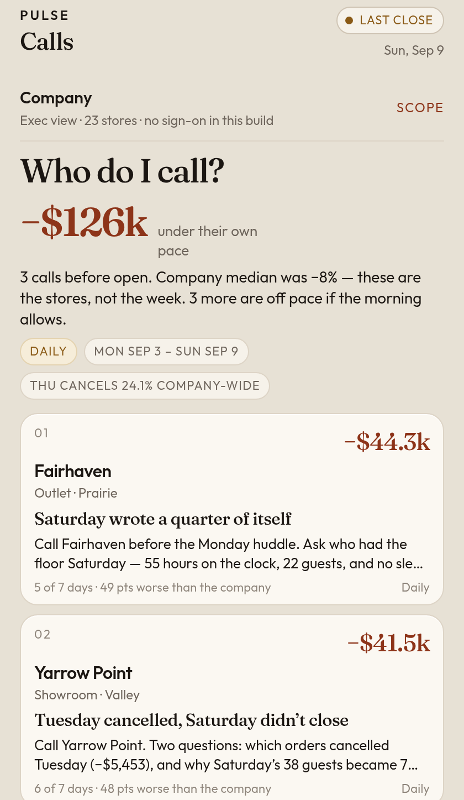
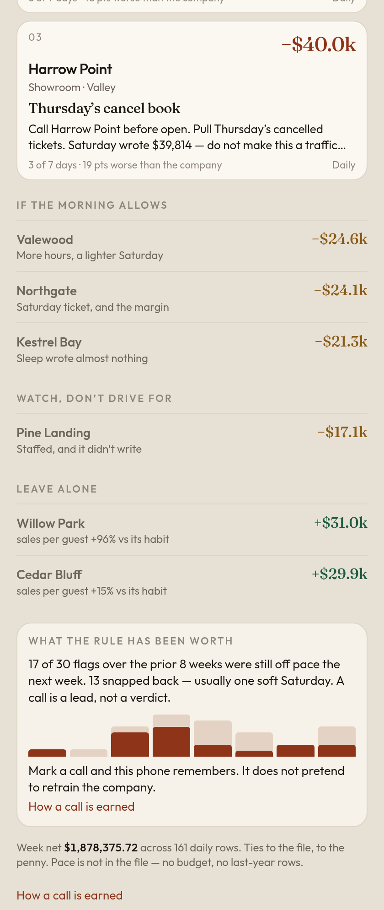
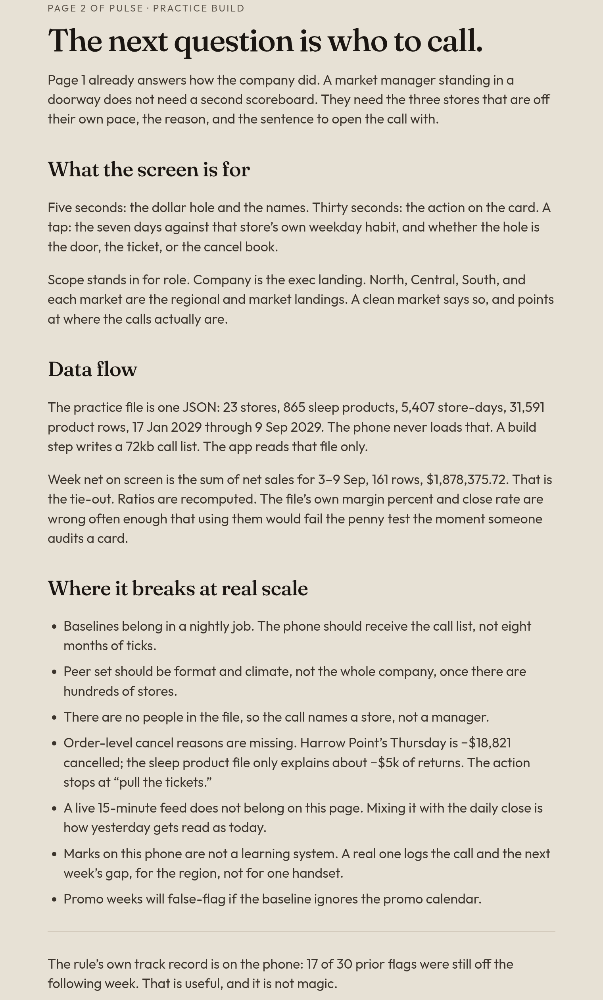

# Pulse · Calls

Page 2 of Pulse for a fictitious home furnishings retailer. Page 1 answers how the company did. This page answers who to call before Monday open.

Practice data only. Store names, places, dates, brands, and dollar scale are masked. Safe to publish.

## Preview

Call list, first screen:



Call list, rest of the page:



How to read it:



## Open it

This folder is a static site. GitHub Pages will serve `index.html`.

```bash
# from a new public repo, after copying these files to the root
git init
git add .
git commit -m "Pulse page 2: who to call"
git branch -M main
git remote add origin git@github.com:YOU/pulse-calls.git
git push -u origin main
```

Then Settings → Pages → Deploy from branch `main` / root. The preview link is `https://YOU.github.io/pulse-calls/`.

No build step on the phone. `data.js` is the call list. The 10MB practice file never ships.

## What a leader sees

Last close is Sun, Sep 9, 2029. There is no live feed in the practice file, so the pill does not pretend otherwise.

Three calls, $126k under their own same-weekday pace. The company median that week was only −8%.

- Fairhaven, −$44.3k. Saturday wrote $6,145 against a $23,625 habit, 55 hours on the clock, no sleep written.
- Yarrow Point, −$41.5k. Tuesday cancelled $5,453. Saturday turned 38 guests into 7 tickets.
- Harrow Point, −$40.0k. Door held. Thursday’s cancel book was −$18,821 against a $17,137 Thursday. Saturday wrote. Do not open on traffic.

Scope stands in for role: company, region, or market. A clean market says so.

## The rule

A store is a call only if all three hold:

- at least $15k and 20% under its own same-weekday pace, prior 8 weeks
- at least 15 points worse than the company median that week
- 4 soft days, or $10k of cancels above its own cancel rate

Pace is not budget and not last year. Neither is in the file.

Same rule, prior 8 weeks: 30 flags, 17 still off the next week, 13 snapped back. A call is a lead, not a verdict. Called, snooze, and not-a-miss stay on the handset. That is memory, not a model retraining in the browser.

## Tie-out

Week net on screen is the sum of `net_sales` for 3–9 Sep 2029: 161 rows, $1,878,375.72.

Rates are recomputed. Stored margin % and close rate disagree with the dollars on about a third of rows. Stored discount % is not used.

Net is the official figure. On 813 of 5,407 store-days, net is a cent off gross plus cancels (421 high, 392 low). The residual is 29 cents. Separate rounding, not a sum error.

## Where it breaks at real scale

- Baselines belong in a nightly job. The phone should receive the call list, not eight months of ticks.
- Peers should be format and climate, not the whole company, once there are hundreds of stores.
- There are no people in the file, so a call names a store, not a manager.
- Order-level cancel reasons are missing. Harrow Point’s Thursday cancels are larger than the sleep return file. The action stops at “pull the tickets.”
- A 15-minute live feed does not belong on this page.
- Promo weeks will false-flag if the baseline ignores the promo calendar.
